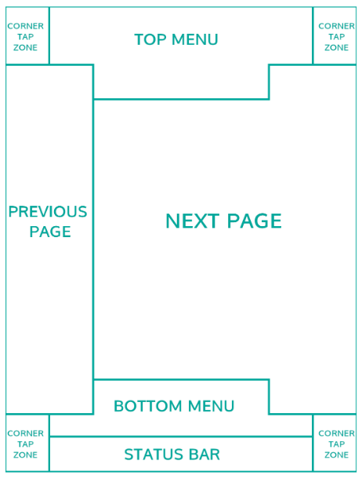
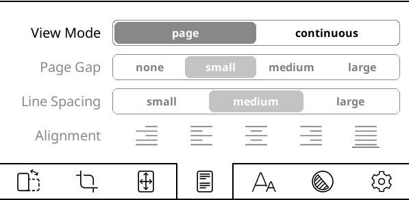
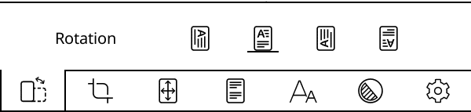
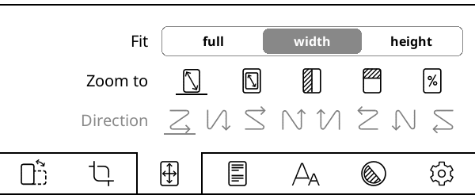
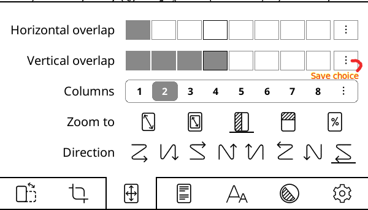

KOreader
========

Koreader is an ebook reader application written for eink devices. It can 
be installed on jailbroken kindle using KAUL. It supports EPUB, PDF, DjVu, 
XPS, CBT, CBZ, FB2, PDB, TXT, HTML, RTF, CHM, DOC, MOBI and many more. Best 
part, it's AGPLed.

## Launch Koreader

From kindle's home, select `KAUL`. Then choose `KOreader` from KAUL menu.
Choose `Start KOreader`. `KOreader` will start after a few seconds. By default 
koreader opens `/mnt/us/` in ko filemanager.

## Koreader tapzones:

## Koreader setup for pdf

### Single page mode

Goto Bottom menu > View mode > page. Choose *contineous page
		mode* for nicer zoomed in view. Zoomed in single page mode 
		may get confusing while turning pages.

### Orientation

Goto Bottom menu > Rotation.

### Zoom

Bottom menu > Zoom to.

### Multiple column

Botom menu > Zoom Coumn and number of columns > reading 
		direction. Set overlaps if needed.
		Similarly in multiple row mode.

## Further reading

1. `https://koreader.rocks/`
